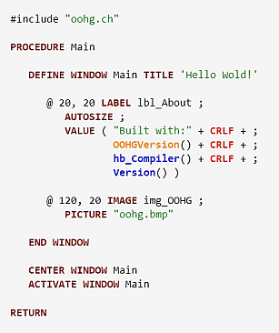
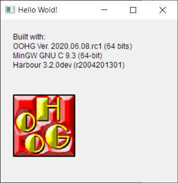

# OOHG - Object Oriented (x)Harbour GUI

OOHG is an object-oriented adaptation of the MiniGUI library for building Windows applications using [Harbour](https://harbour.github.io/) and [xHarbour](http://www.xharbour.org/) languages. Its 32 and 64 bits libraries offer an easy but yet powerfull way of adding a graphical user interface to your (x)Harbour applications under Windows.

 | 
